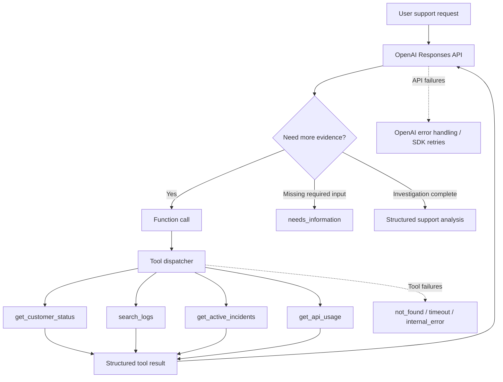

# Support Troubleshooting Agent

A portfolio project demonstrating how to build a tool-using technical support agent with the OpenAI Responses API.

The agent investigates customer-reported API issues using mock support backends, decides which tools to call, handles backend and OpenAI API failures, maintains conversation state, and returns a typed structured diagnosis.

> **Portfolio project:** This repository is not an official OpenAI support product. Customer data, logs, incidents, and usage data are mocked for demonstration purposes.

## What this project demonstrates

- OpenAI **Responses API**
- Streaming model output
- Function/tool calling
- Strict tool parameter schemas
- Multi-step tool orchestration
- Multiple tool calls across investigation rounds
- Conversation state with `previous_response_id`
- Structured Outputs with Pydantic
- Grounding responses in tool results
- Missing-information handling
- Tool/backend failure handling
- Retryable vs. non-retryable failures
- OpenAI API timeout, connection, rate-limit, authentication, permission, bad-request, and server-error handling
- SDK retries and request timeouts
- Guardrails against unbounded tool-call loops

## Architecture



## Investigation flow

A typical request may look like:

```text
Customer report
    ↓
Model determines required evidence
    ↓
Customer status
    ↓
Logs
    ↓
API usage and/or active incidents
    ↓
Evidence returned to model
    ↓
Structured diagnosis + recommended actions
```

The model is explicitly instructed not to invent missing customer IDs, error codes, tool results, or other required inputs.

## Tools

### `get_customer_status`

Returns mocked account/service information such as:

- plan
- region
- account status
- number of open incidents

### `search_logs`

Looks up a customer/error-code combination and returns a representative log finding.

Demo error codes include:

- `401` — invalid API key
- `429` — rate limit exceeded
- `500` — internal server error
- `503` — authentication service unavailable

The mock also includes simulated `not_found` and timeout behavior.

### `get_active_incidents`

Returns a mocked active incident for the requested service.

### `get_api_usage`

Returns mocked recent request volume, rate limit, and failed-request counts for selected customers.

## Structured response

Final agent responses are parsed into Pydantic models instead of relying on arbitrary free-form text.

The top-level response is one of two states:

```python
class AgentResponse(BaseModel):
    status: Literal["needs_information", "analysis_complete"]
    question: str | None
    analysis: SupportAnalysis | None
```

When information required for investigation is missing, the agent returns `needs_information`.

When the investigation is complete, it returns `analysis_complete` with:

- incident facts
- customer impact
- escalation decision
- summary
- prioritized recommended actions
- action owner

Example shape:

```json
{
  "status": "analysis_complete",
  "question": null,
  "analysis": {
    "incident": {
      "service": "authentication",
      "error_code": 503,
      "environment": "production"
    },
    "impact": {
      "affected_users": null,
      "affected_percentage": null,
      "locations": []
    },
    "needs_escalation": true,
    "summary": "The available evidence points to an authentication service incident.",
    "recommended_actions": [
      {
        "action": "Track the active authentication incident and communicate impact to the customer.",
        "priority": "high",
        "owner": "support"
      }
    ]
  }
}
```

## Error handling

The project intentionally distinguishes between two failure domains.

### OpenAI API failures

The client is configured with retries and a request timeout:

```python
client = OpenAI(
    max_retries=3,
    timeout=30,
)
```

The application separately handles:

- API timeouts
- rate limits
- connection errors
- server errors
- authentication failures
- bad requests
- unexpected OpenAI API errors

### Tool/backend failures

Mock backend tools return a consistent envelope:

```json
{
  "ok": false,
  "error": {
    "code": "timeout",
    "message": "The backend service timed out.",
    "retryable": true
  }
}
```

This allows the model to distinguish between:

- a successful lookup that returned no relevant data, and
- a lookup that failed and therefore cannot support a conclusion.

## Project structure

```text
support-troubleshooting-agent/
├── main.py
├── README.md
├── requirements.txt
├── .gitignore
└── LICENSE
```

## Requirements

- Python 3.10+
- An OpenAI API key
- `openai`
- `pydantic`

## Setup

Clone the repository and enter the project directory:

```bash
git clone <your-repository-url>
cd support-troubleshooting-agent
```

Create and activate a virtual environment:

```bash
python3 -m venv .venv
source .venv/bin/activate
```

On Windows PowerShell:

```powershell
python -m venv .venv
.venv\Scripts\Activate.ps1
```

Install dependencies:

```bash
pip install -r requirements.txt
```

Set your OpenAI API key.

macOS/Linux:

```bash
export OPENAI_API_KEY="your_api_key_here"
```

Windows PowerShell:

```powershell
$env:OPENAI_API_KEY="your_api_key_here"
```

Run the agent:

```bash
python main.py
```

## Demo scenarios

The mock backend supports several useful tests.

### Authentication/service incident

```text
cust_123 is receiving HTTP 503 errors in production.
```

This gives the agent enough information to investigate logs and potentially correlate the issue with an active service incident.

### Rate-limit investigation

```text
cust_123 is receiving HTTP 429 errors in production.
```

The agent can inspect API usage to evaluate whether the customer is close to its configured request limit.

### Missing information

```text
cust_123 is having API problems.
```

The agent should avoid inventing an error code and return a structured `needs_information` response instead.

### Missing customer

```text
cust_404 is receiving HTTP 503 errors in production.
```

The mock backend returns a non-retryable `not_found` result.

### Backend timeout

```text
cust_timeout is receiving HTTP 503 errors in production.
```

The log-search tool simulates a retryable backend timeout. The agent is instructed not to interpret this as evidence that no logs exist.

## Design decisions

### Why use a manual tool loop?

This project intentionally implements the tool orchestration loop directly with the Responses API instead of hiding it behind a higher-level agent framework.

That makes the control flow visible:

1. Send the user request.
2. Inspect model output for function calls.
3. Validate and execute requested tools.
4. Send `function_call_output` objects back to the model.
5. Repeat if additional evidence is needed.
6. Return the final structured analysis.

For a support-engineering project, this makes API behavior and failure boundaries easier to inspect and explain.

### Why mock the backend?

The goal is to demonstrate OpenAI API integration and support-oriented reasoning rather than infrastructure setup. Mock services make the scenarios deterministic and keep the project small enough to review quickly.

## Limitations

This is intentionally a compact portfolio project.

It does not include:

- a production customer database
- real application logs
- real incident-management integrations
- authentication/authorization
- persistent application storage
- a web UI
- automatic retries for downstream tools
- production observability

These would be natural extensions in a production system, but are outside the scope of this demonstration.

## Possible future improvements

- Connect tools to a real log/search backend
- Add observability and request tracing
- Add a web or ticketing-system interface


## Related projects

- [Incident Analyzer](https://github.com/SergiiBelik/incident-analyzer) —
  Application that uses OpenAI Responses API and Structured Outputs to transform messy incident evidence into a structured operational analysis.

## References

- OpenAI API documentation: https://platform.openai.com/docs
- OpenAI Python SDK: https://github.com/openai/openai-python

## License

MIT License. See `LICENSE`.
